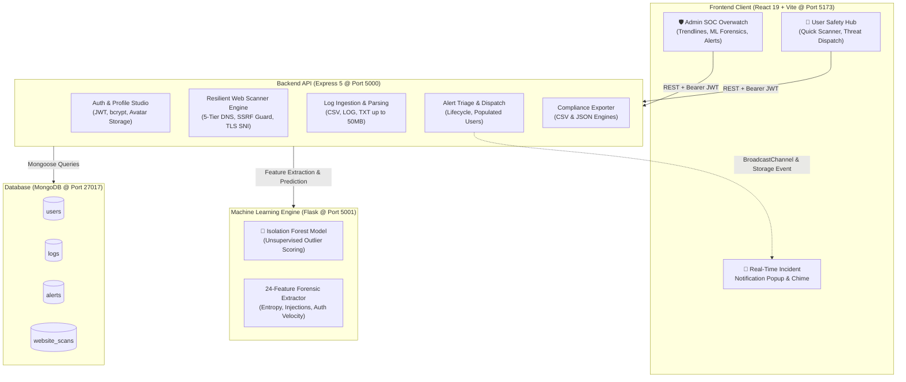

# 🛡️ Smart Anomaly Detection System
### *Autonomous Cyber Threat Detection, Neural Log Telemetry & Defensive Security Operations Platform*

[](https://react.dev/)
[](https://nodejs.org/)
[](https://scikit-learn.org/)
[](https://www.mongodb.com/)
[](LICENSE)
[]()

---

## 📖 Overview

The **Smart Anomaly Detection System** is an enterprise-grade cybersecurity operations platform (SOC) and user security portal designed to detect, analyze, and mitigate cyber threats in real time. 

The platform bridges complex machine learning security forensics with consumer-friendly protection through a **dual Role-Based Access Control (RBAC)** experience:
1. **SOC Administrator Portal**: Deep mathematical telemetry, unsupervised **Isolation Forest** feature space evaluation, 24-feature log forensics, attack vector taxonomy mapped to the MITRE ATT&CK framework, and alert triage.
2. **Client / Operator Portal**: A clean, accessible security hub with an **in-dashboard instant website scanner**, a reassuring account health status card, quick threat reporting to the SOC, and plain-language security checklists.

The system is styled in an **Emerald Mint (`#00d68f`)** and **Forest Green (`#0c3631`)** palette with crisp white surfaces, glassmorphic panels, and responsive micro-animations.

---

## 🏗️ System Architecture



---

## ✨ Key Capabilities & Modules

### 1. 🛡️ Dual Role-Based Experience (RBAC)
- **SOC Administrator View**:
  - Full operations command center with interactive SVG line charts for daily anomaly velocity.
  - Mathematical SVG threat score gauge (`pathLength="100"`).
  - MITRE ATT&CK taxonomy breakdown (Brute Force, SQL Injection, DDoS, Port Scanning, DNS Tunneling).
  - System logs telemetry table with anomaly indicators.
  - In-dashboard **`[👤 User View]`** toggle allowing admins to preview the user portal without logging out.
- **Client User Friendly View**:
  - Reassuring **Account Protection Banner** with animated glowing shield (`🛡️ 100% Protected`).
  - **Embedded Quick Website Checker**: Test any domain directly from the dashboard.
  - **3 Consumer Action Tiles**: *Check a File*, *Website Scanner*, *Report a Problem*.
  - Clean **Activity Feed** (Safe vs Needs Attention) without confusing technical database tables.
  - Plain-language **Online Safety Tips** (Google Security style).

---

### 2. 🌐 Website Security & Resilient DNS Scanner
- **5-Tier Resilient DNS Resolution**:
  - Bypasses local router and Windows IPv6 lookup glitches by automatically cycling through:
    1. OS `getaddrinfo` (`dns.promises.lookup`)
    2. Node.js built-in `dns.promises.resolve4`
    3. Google DNS (`8.8.8.8` & `8.8.4.4`)
    4. Cloudflare DNS (`1.1.1.1` & `1.0.0.1`)
    5. Quad9 DNS (`9.9.9.9`)
- **Server-Side Request Forgery (SSRF) Protection**:
  - Strictly enforces `http:` and `https:`.
  - Rejects loopback addresses (`127.0.0.0/8`, `::1`), private subnets (`10.0.0.0/8`, `172.16.0.0/12`, `192.168.0.0/16`), cloud metadata services (`169.254.169.254`, `metadata.google.internal`), and link-local ranges.
- **SSL/TLS Certificate Inspection**:
  - Direct connection to resolved IP with Server Name Indication (SNI `servername: hostname`) to avoid redundant DNS roundtrips.
  - Extracts Issuer, Subject, Validity Dates, and Days Remaining.
- **Security Headers Audit**:
  - Evaluates `Content-Security-Policy`, `Strict-Transport-Security` (HSTS), `X-Frame-Options`, `X-Content-Type-Options`, `Referrer-Policy`, and `Permissions-Policy`.
- **Redirect Tracking**:
  - Follows up to 5 redirect hops, re-validating each hop against SSRF filters.
- **Automated Risk Scoring**:
  - Calculates risk score (5–100) and risk level (`Low`, `Medium`, `High`) with persistent history in MongoDB.

---

### 3. 🚨 Real-Time Incident Reporting & Admin Popups
- **Self-Service Threat Reporting** (`/report-incident`):
  - Users can easily submit suspicious emails, phishing links, strange login prompts, or malicious files.
  - Creates an alert in MongoDB with `[User Report]` tagging and populated user details.
- **Admin Floating Popup Notification**:
  - When a user submits a report, an unmissable floating popup notification appears in the top-right corner on **any page** the Admin is browsing.
  - **Audio Alert**: Plays a subtle two-tone audio chime via the native browser Web Audio API (`AudioContext`).
  - **Reporter Details**: Shows sender name, email, urgency pill (`CRITICAL`, `HIGH`, `MEDIUM`, `LOW`), summary, and 1-click **`[View in Alerts →]`** navigation.
  - **Dual-Dispatch Engine**: Delivered instantly via `BroadcastChannel` and `localStorage` events (0ms cross-tab), backed by 4-second background polling across different devices.

---

### 4. 🤖 Machine Learning Telemetry Engine
- **Unsupervised Isolation Forest**:
  - Evaluates multidimensional log feature vectors to isolate anomalous activity without requiring manual rule curation.
- **24 Forensic Extracted Features**:
  - Failed login velocities, shell command markers (`/bin/sh`, `curl`, `powershell`), SQL injection fragments (`UNION SELECT`, `' OR 1=1`), SYN flood bursts, high-port sweeps, and packet entropy ratios.
- **Forensic Interpretability**:
  - Generates anomaly confidence scores (0.00 – 1.00), feature importance breakdowns, and natural-language summaries.

---

### 5. 📁 Log Ingestion & Forensics Studio
- **Universal Log Support**:
  - Ingests raw `.log`, `.txt`, and `.csv` files up to 50MB via drag-and-drop.
- **Built-In Attack Presets**:
  - Instant 1-click test datasets: *SSH Brute Force*, *SQL Injection Probe*, *SYN Flood DDoS*, *DNS Tunneling*, and *Normal Baseline Traffic*.

---

### 6. 👤 Profile Studio & Avatar Studio (`/profile`)
- **Avatar Management**:
  - Upload custom profile photos with automatic in-browser HTML5 Canvas compression (keeps uploads lightweight and fast).
  - 5 pre-rendered vector security avatars.
  - One-click avatar removal.
- **3-Tab Configuration**:
  - **Identity**: Name, email, operational role, bio, and profile photo.
  - **Clearance & Organization**: Analyst ID, Station ID, Enclave department, and Clearance tier.
  - **Alerting Rules**: Custom switches for P1 surge alarms, autonomous mitigation, model drift notifications, and weekly compliance digests.
- **Universal Synchronization**:
  - Profile photo updates immediately synchronize across the sidebar, user dashboard, and alert triage cards.

---

### 7. 📈 Compliance Reports & Exporters (`/reports`)
- Executive summary metrics on system health, total events, and anomaly ratios.
- Instant 1-click data exports to both **JSON** and **CSV**.

---

## 📁 Repository Structure

```text
smart-anomaly-detection/
├── backend/                              # Node.js + Express 5 REST API
│   ├── src/
│   │   ├── config/                       # Database connections & demo seeders
│   │   │   ├── db.js                     # MongoDB connection with retry logic
│   │   │   ├── seed.js                   # Initial admin & demo data seeder
│   │   │   └── testDb.js                 # DB connection verification utility
│   │   ├── controllers/                  # Route business logic
│   │   │   ├── alertController.js        # Alerts triage & user-populated reports
│   │   │   ├── analysisController.js     # ML proxy & feature evaluations
│   │   │   ├── authController.js         # JWT auth, profile studio & avatar saves
│   │   │   ├── dashboardController.js    # Aggregate telemetry & statistics
│   │   │   ├── logController.js          # File uploads, parsing & preset ingestion
│   │   │   ├── reportsController.js      # CSV/JSON compliance reporting
│   │   │   └── websiteScannerController.js# Website scanner API endpoints
│   │   ├── middleware/                   # Express middlewares
│   │   │   └── auth.js                   # JWT verification & role authorization
│   │   ├── models/                       # Mongoose schemas
│   │   │   ├── Alert.js                  # Alerts with severity, MITRE types & status
│   │   │   ├── Anomaly.js                # Detected anomalies & feature vectors
│   │   │   ├── Log.js                    # Ingested logs & line items
│   │   │   ├── User.js                   # User accounts, avatars, bios & clearance
│   │   │   └── WebsiteScan.js            # Website scan records, certs & headers
│   │   ├── routes/                       # Express route mappings
│   │   │   ├── alertRoutes.js            # /api/alerts
│   │   │   ├── analysisRoutes.js         # /api/analysis
│   │   │   ├── anomalyRoutes.js          # /api/anomalies
│   │   │   ├── authRoutes.js             # /api/auth
│   │   │   ├── dashboardRoutes.js        # /api/dashboard
│   │   │   ├── logRoutes.js              # /api/logs
│   │   │   ├── reportsRoutes.js          # /api/reports
│   │   │   └── websiteScannerRoutes.js   # /api/website-scanner
│   │   ├── services/                     # Core background services
│   │   │   └── scannerService.js         # 5-tier DNS, SSRF guard & TLS inspector
│   │   ├── app.js                        # Express app setup & body limit config
│   │   └── server.js                     # Server entrypoint (Port 5000)
│   ├── scripts/                          # Demo and verification scripts
│   ├── tests/                            # Automated Jest test suites (6 suites, 42 tests)
│   ├── .env                              # Environment variables
│   └── package.json
│
├── frontend/                             # React 19 + Vite Application
│   ├── src/
│   │   ├── components/                   # Modular components
│   │   │   ├── AppLayout.jsx             # Shell layout, dynamic RBAC sidebar & notification listener
│   │   │   ├── AppLayout.css
│   │   │   ├── IncidentNotificationPopup.jsx # Floating admin popup modal with Web Audio chime
│   │   │   ├── IncidentNotificationPopup.css
│   │   │   └── ProtectedRoute.jsx        # Route guard for authenticated users
│   │   ├── context/
│   │   │   └── AuthContext.jsx           # Global user authentication & token management
│   │   ├── pages/                        # View pages
│   │   │   ├── Alerts.jsx & .css         # Incident response & alert triage
│   │   │   ├── Dashboard.jsx & .css      # Admin SOC command center
│   │   │   ├── LogUpload.jsx & .css      # Drag-and-drop log ingestion
│   │   │   ├── Login.jsx & .css          # Emerald cyber login screen
│   │   │   ├── MLAnalysis.jsx & .css     # ML feature evaluation & heatmaps
│   │   │   ├── Profile.jsx & .css        # Avatar studio & clearance settings
│   │   │   ├── Register.jsx & .css       # New account registration
│   │   │   ├── ReportIncident.jsx & .css # User threat & issue reporting
│   │   │   ├── Reports.jsx & .css        # Compliance summaries & data export
│   │   │   ├── UserDashboard.jsx & .css  # Consumer-friendly user portal
│   │   │   └── WebsiteScanner.jsx & .css # Full-featured website security scanner
│   │   ├── services/
│   │   │   └── api.js                    # Axios instance with auth interceptor
│   │   ├── App.jsx                       # Application router & route definitions
│   │   ├── main.jsx                      # Vite entrypoint
│   │   └── index.css                     # Global reset & CSS custom properties
│   ├── index.html
│   ├── vite.config.js
│   └── package.json
│
└── ml-service/                           # Python 3.11 Machine Learning Microservice
    ├── models/                           # Trained Isolation Forest model (.pkl)
    ├── app.py                            # Flask inference service & feature extractor
    └── requirements.txt                  # Python dependencies
```

---

## 🛠️ Technology Stack

| Domain | Technologies Used |
| :--- | :--- |
| **Frontend** | React 19, React Router 7, Vite 8, Axios, HTML5 Canvas API, Web Audio API |
| **Styling** | Modular Vanilla CSS, Emerald & Forest Green Design System, Glassmorphic Panels |
| **Backend** | Node.js 22, Express 5, JWT (`jsonwebtoken`), `bcryptjs`, `multer`, `csv-parser` |
| **Networking & Security** | Node.js `dns.promises`, `tls` SNI binding, SSRF address sanitization, custom User-Agents |
| **Machine Learning** | Python 3.11, Flask, Scikit-Learn (Isolation Forest), NumPy, Pandas |
| **Database** | MongoDB 6+, Mongoose 9 |
| **Testing & Tooling** | Jest, Supertest, Nodemon, Vite Build Engine |

---

## ⚙️ Prerequisites

Make sure the following tools are installed on your machine:
- **Node.js**: v18.0.0 or higher ([Download](https://nodejs.org/))
- **Python**: v3.10 or v3.11 ([Download](https://www.python.org/))
- **MongoDB**: Community Server installed locally (`mongodb://127.0.0.1:27017`) or a free [MongoDB Atlas](https://www.mongodb.com/cloud/atlas) cluster

---

## 🚀 Step-by-Step Setup & Running Guide

### 1. Environment Configuration

Verify or create `backend/.env`:
```env
NODE_ENV=development
PORT=5000
MONGODB_URI=mongodb://127.0.0.1:27017/anomaly_detection
JWT_SECRET=smart_anomaly_detection_jwt_secret_2026
ML_SERVICE_URL=http://localhost:5001
```

> **Using MongoDB Atlas?**
> Replace `MONGODB_URI` with your connection string:
> `mongodb+srv://<username>:<password>@cluster.mongodb.net/anomaly_detection?retryWrites=true&w=majority`

---

### 2. Launch the Services

Open **three separate terminal windows**:

#### Terminal 1 — Machine Learning Service (Python)
```powershell
cd ml-service
py -3 -m pip install -r requirements.txt
py -3 app.py
```
*Runs on `http://localhost:5001` (Loads the Isolation Forest model and feature extraction pipelines).*

#### Terminal 2 — Backend API (Node.js)
```powershell
cd backend
npm install
npm start
```
*Runs on `http://localhost:5000` (Connects to MongoDB, seeds initial demo accounts if empty).*

#### Terminal 3 — Frontend Web Application (React)
```powershell
cd frontend
npm install
npm run dev
```
*Runs on `http://localhost:5173`.*

---

### 3. Open the Application

Visit **[http://localhost:5173](http://localhost:5173)** in your browser.

#### Pre-Configured Test Accounts:

| Role | Email | Password | What You Will See |
| :--- | :--- | :--- | :--- |
| **Admin** | `demo@soc.io` | `demo123` | Full SOC Operations Dashboard, ML Analytics, Alert Triage, Compliance Reports, and Incoming User Incident Popups. |
| **User** | `muhammad@gmail.com` | `123456` | Simple User Safety Dashboard, In-Dashboard Quick Website Checker, File Checks, and Direct Threat Reporting. |

*(You can also click **"Sign up"** to create a fresh user account anytime).*

---

## 📡 API Reference Summary

### Authentication & Profile (`/api/auth`)
| Method | Endpoint | Description | Auth |
| :--- | :--- | :--- | :--- |
| `POST` | `/api/auth/register` | Register a new user or analyst account | Public |
| `POST` | `/api/auth/login` | Authenticate and obtain JWT Bearer token | Public |
| `GET` | `/api/auth/profile` | Retrieve active operator profile, avatar, and policies | Bearer |
| `PUT` | `/api/auth/profile` | Update profile fields, bio, avatar, and notification settings | Bearer |

### Website Security Scanner (`/api/website-scanner`)
| Method | Endpoint | Description | Auth |
| :--- | :--- | :--- | :--- |
| `POST` | `/api/website-scanner/scan` | Audit a URL (resilient DNS, TLS certs, security headers, SSRF check) | Bearer |
| `GET` | `/api/website-scanner/history` | Retrieve user's previous website scans | Bearer |
| `GET` | `/api/website-scanner/:id` | Fetch complete audit details of a scan | Bearer |
| `DELETE`| `/api/website-scanner/:id` | Delete a scan record | Bearer |

### Alerts & Incident Response (`/api/alerts`)
| Method | Endpoint | Description | Auth |
| :--- | :--- | :--- | :--- |
| `GET` | `/api/alerts` | List alerts (Admins see all with populated user details; Users see their own) | Bearer |
| `POST` | `/api/alerts` | Create incident ticket (from user report or anomaly simulation) | Bearer |
| `PATCH` | `/api/alerts/:id/status`| Update status (`new`, `investigating`, `resolved`) | Bearer |
| `DELETE`| `/api/alerts/:id` | Remove an alert record | Bearer |

### Log Ingestion & Forensics (`/api/logs`)
| Method | Endpoint | Description | Auth |
| :--- | :--- | :--- | :--- |
| `POST` | `/api/logs/upload` | Upload `.log`, `.txt`, or `.csv` file for parsing | Bearer |
| `POST` | `/api/logs/preset` | Ingest synthetic attack preset logs | Bearer |
| `GET` | `/api/logs` | Fetch all ingested log files and anomaly verdicts | Bearer |
| `POST` | `/api/logs/:id/analyze` | Request ML Isolation Forest feature analysis | Bearer |
| `DELETE`| `/api/logs/:id` | Delete log file and associated records | Bearer |

### Compliance & Reports (`/api/reports`)
| Method | Endpoint | Description | Auth |
| :--- | :--- | :--- | :--- |
| `GET` | `/api/reports/summary` | Aggregate historical metrics & threat vectors | Bearer |
| `GET` | `/api/reports/export?format=json` | Download complete audit report as JSON | Bearer |
| `GET` | `/api/reports/export?format=csv` | Download complete audit report as CSV | Bearer |

---

## 🧪 Testing & Verification

### Backend Automated Test Suite
Run the automated test suite across all controllers:
```powershell
cd backend
npm test
```
*Result: 6 test suites, 42 tests passing (`auth`, `authorization`, `alerts`, `logs`, `analysis`, `reports`).*

### Frontend Production Build
To verify bundling and syntax integrity:
```powershell
cd frontend
npm run build
```
*Result: Clean compilation into `dist/` with zero errors.*

---

## 🔒 Security Best Practices Implemented

- **SSRF Immunity**: The website scanner strictly rejects loopback, private IPv4/IPv6, and cloud metadata hostnames.
- **Fail-Safe Fallbacks**: Multi-tier DNS ensures network hiccups or Windows IPv6 quirks never crash scanning services.
- **Strict Role-Based Authorization**: Data access is strictly partitioned between admin operations and regular user enclaves.
- **Cryptographic Password Storage**: Passwords hashed with high-cost salt rounds via `bcryptjs`.
- **Payload Limits**: Image uploads compressed client-side before transmission and protected by a 10MB backend ceiling.
- **Zero-Dependency Audio Alerts**: Real-time admin chimes run entirely via browser Web Audio API synthesis without external network assets.

---

## 📄 License

This project is licensed under the **MIT License**. See `LICENSE` for details.
