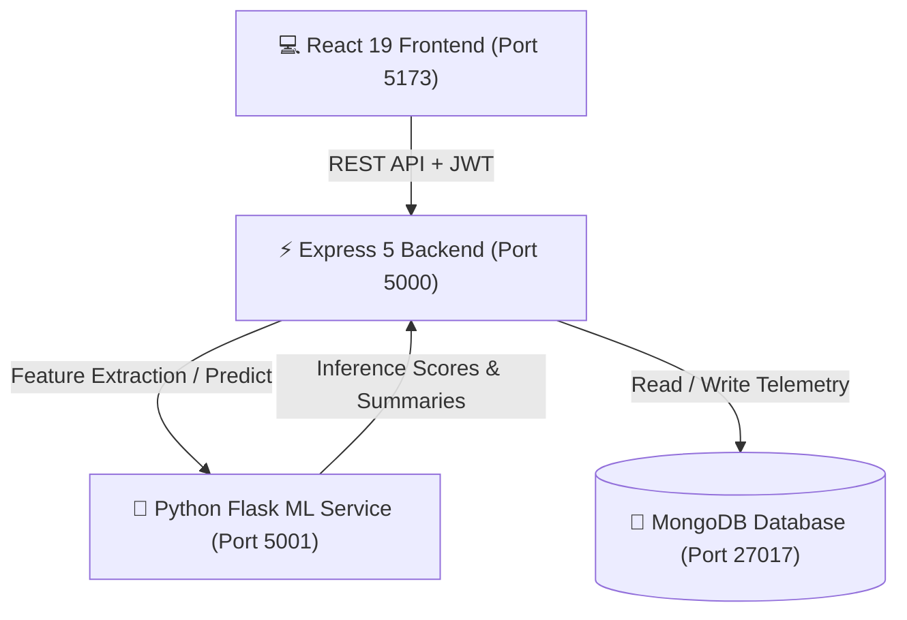

# 🛡️ Smart Anomaly Detection System
### *Autonomous Cyber Threat Detection & Neural Telemetry Platform*

[](https://react.dev/)
[](https://nodejs.org/)
[](https://scikit-learn.org/)
[](https://www.mongodb.com/)
[](LICENSE)

---

## 📖 Overview

The **Smart Anomaly Detection System** is an enterprise-grade, full-stack cybersecurity operations platform (SOC) engineered to detect, classify, and mitigate cyber threats in real time.

Combining an **unsupervised machine learning engine (Isolation Forest)**, a **high-throughput Express API**, and a **custom glassmorphic React dashboard**, the platform ingests raw server and firewall logs, extracts 24 security features, evaluates anomaly scores, and triggers autonomous mitigation workflows.

---

## ✨ Key Capabilities

- **📊 Dynamic SOC Operations Dashboard**:
  - Live Log Ingestion Velocity with dynamic sparkline distribution.
  - Real-time Threat Detection Index calibrated against active incident severity.
  - Mathematical SVG Semi-Circular Threat Gauge (`pathLength="100"` with fluid SVG offset).
  - Attack Vector Taxonomy breakdown directly mapped against the MITRE ATT&CK framework.
  - Interactive Geographic Threat Map with dynamic hotspot radars.
  - Live Incident Telemetry Stream directly synced with the database.
  - One-click **Simulate Anomaly Spike** for operator fire-drill training.

- **🤖 Neural ML Anomaly Detection Engine**:
  - Unsupervised **Isolation Forest** trained on multidimensional log feature spaces.
  - Automated extraction of **24 forensic features**: authentication failure velocity, shell injection keywords, SQL injection signatures, port scan markers, entropy ratios, and error bursts.
  - Detailed feature importance breakdown and autonomous natural language forensic summaries.

- **🚨 Incident Response & Alert Triage Center**:
  - Full lifecycle tracking: `NEW` ➔ `INVESTIGATING` ➔ `RESOLVED`.
  - Severity classification: `CRITICAL`, `HIGH`, `MEDIUM`, and `LOW`.
  - Quarantine enforcement, automated mitigation notes, and threat indicators display.

- **📁 Log Ingestion & Forensic Upload**:
  - Supports raw `.log`, `.txt`, and `.csv` system and network logs.
  - Includes instant 1-click preset logs: *SSH Brute Force Attack*, *SQL Injection Probe*, *SYN Flood DDoS*, *DNS Tunneling*, and *Normal Baseline Traffic*.

- **📈 Compliance Reports & Data Exporter**:
  - Comprehensive aggregation of security incidents and log metrics over time.
  - Instant one-click **JSON** and **CSV** audit report downloads.

- **👤 Persistent Operator Profile**:
  - Full name, operational email, primary role, emergency contacts, department enclave, timezone, Analyst ID (`#soc-XXXX`), and security clearance level.
  - Dual-layer persistence: directly saved to **MongoDB** with instant local caching.
  - Custom alerting policy switches (P1 Surge Alerts, Autonomous Host Quarantine, Model Drift Alarms, Weekly Digests).

---

## 🏗️ Architecture



---

## 📁 Repository Structure

```text
smart-anomaly-detection/
├── backend/                  # Node.js Express REST API
│   ├── src/
│   │   ├── config/           # Database connection & seeders (db.js, seed.js, testDb.js)
│   │   ├── controllers/      # Route controllers (alert, analysis, auth, dashboard, log, reports)
│   │   ├── middleware/       # Auth JWT middleware & validation
│   │   ├── models/           # Mongoose schemas (User, Log, Alert)
│   │   ├── routes/           # Express API route declarations
│   │   ├── app.js            # Express application configuration
│   │   └── server.js         # HTTP server entrypoint
│   ├── tests/                # Automated Jest test suites (42 tests across 6 suites)
│   ├── .env                  # Backend configuration
│   └── package.json
│
├── frontend/                 # React 19 + Vite Web Application
│   ├── src/
│   │   ├── components/       # Reusable components (AppLayout, Navbar, etc.)
│   │   ├── context/          # Global AuthContext & user state
│   │   ├── design-system/    # Color tokens & CSS variables
│   │   ├── pages/            # View pages (Dashboard, Alerts, LogUpload, MLAnalysis, Reports, Profile, Login, Register)
│   │   ├── services/         # Axios API interceptor service
│   │   └── App.jsx           # Routing and application layout
│   ├── index.html
│   ├── vite.config.js
│   └── package.json
│
└── ml-service/               # Python 3.11 Machine Learning Engine
    ├── models/               # Saved Isolation Forest model (.pkl) & scaler
    ├── app.py                # Flask inference API & 24-feature extractor
    └── requirements.txt      # Python dependencies
```

---

## ⚙️ Prerequisites

Ensure you have the following installed on your system:
- **Node.js**: v18.0.0 or higher ([Download](https://nodejs.org/))
- **Python**: v3.10 or v3.11 ([Download](https://www.python.org/))
- **MongoDB**: v6.0+ installed locally or a free [MongoDB Atlas](https://www.mongodb.com/cloud/atlas) cluster

---

## 🚀 Quick Start Guide

### 1. Configure the Backend

Create or verify `backend/.env`:

```env
NODE_ENV=development
PORT=5000
MONGODB_URI=mongodb://127.0.0.1:27017/anomaly_detection
JWT_SECRET=smart_anomaly_detection_jwt_secret_2026
ML_SERVICE_URL=http://localhost:5001
```

> **Using MongoDB Atlas?**
> Replace `MONGODB_URI` with your Atlas connection string:
> `mongodb+srv://<user>:<password>@cluster.mongodb.net/anomaly_detection?retryWrites=true&w=majority`

Verify your database connection anytime:
```powershell
cd backend
npm run test:db
```

---

### 2. Run the Services

Open **three separate terminal windows**:

#### Terminal 1 — Machine Learning Service
```powershell
cd ml-service
py -3 -m pip install -r requirements.txt
py -3 app.py
```
*Runs on `http://localhost:5001` (Loads Isolation Forest model & feature extractors).*

#### Terminal 2 — Backend API
```powershell
cd backend
npm install
npm run dev
```
*Runs on `http://localhost:5000` (Auto-seeds database if empty).*

#### Terminal 3 — Frontend Client
```powershell
cd frontend
npm install
npm run dev
```
*Runs on `http://localhost:5173`.*

---

### 3. Access the Application

Open your browser and navigate to:
👉 **[http://localhost:5173](http://localhost:5173)**

#### Default Operator Credentials:
- **Email:** `demo@soc.io`
- **Password:** `demo123`
*(Or click **"Instant Demo Operator Access"** on the login screen).*

---

## 📡 API Reference

### Authentication & Profile (`/api/auth`)
| Method | Endpoint | Description | Auth Required |
| :--- | :--- | :--- | :--- |
| `POST` | `/api/auth/register` | Register new analyst account | No |
| `POST` | `/api/auth/login` | Authenticate & retrieve JWT token | No |
| `GET` | `/api/auth/profile` | Retrieve active operator profile | Yes (Bearer) |
| `PUT` | `/api/auth/profile` | Update profile fields & notification policies | Yes (Bearer) |

### Dashboard Telemetry (`/api/dashboard`)
| Method | Endpoint | Description | Auth Required |
| :--- | :--- | :--- | :--- |
| `GET` | `/api/dashboard/stats` | Retrieve dynamic metrics, gauge score, sparklines & recent activity | Yes (Bearer) |
| `PATCH` | `/api/dashboard/toggle-defense` | Enable/pause autonomous mitigation shield | Yes (Bearer) |

### Log Management & Analysis (`/api/logs`)
| Method | Endpoint | Description | Auth Required |
| :--- | :--- | :--- | :--- |
| `POST` | `/api/logs/upload` | Upload `.log`, `.txt`, or `.csv` file for ingestion | Yes (Bearer) |
| `POST` | `/api/logs/preset` | Ingest synthetic attack/nominal preset logs | Yes (Bearer) |
| `GET` | `/api/logs` | Fetch ingested logs with status & anomaly scores | Yes (Bearer) |
| `POST` | `/api/logs/:id/analyze` | Send log to ML service for Isolation Forest prediction | Yes (Bearer) |
| `GET` | `/api/logs/:id/result` | Fetch ML forensic feature breakdown | Yes (Bearer) |
| `DELETE`| `/api/logs/:id` | Purge log and linked alerts | Yes (Bearer) |

### Alerts & Incident Response (`/api/alerts`)
| Method | Endpoint | Description | Auth Required |
| :--- | :--- | :--- | :--- |
| `GET` | `/api/alerts` | List all alerts with filtering by severity & status | Yes (Bearer) |
| `POST` | `/api/alerts` | Create incident ticket (e.g. from spike simulation) | Yes (Bearer) |
| `PATCH` | `/api/alerts/:id/status`| Update status (`new`, `investigating`, `resolved`) | Yes (Bearer) |
| `DELETE`| `/api/alerts/:id` | Purge alert from ledger | Yes (Bearer) |

### Reports & Audits (`/api/reports`)
| Method | Endpoint | Description | Auth Required |
| :--- | :--- | :--- | :--- |
| `GET` | `/api/reports/summary` | Aggregate historical trends & distribution | Yes (Bearer) |
| `GET` | `/api/reports/export?format=json` | Export compliance report as JSON | Yes (Bearer) |
| `GET` | `/api/reports/export?format=csv` | Export compliance report as CSV | Yes (Bearer) |

---

## 🧪 Testing & Validation

### Backend Automated Test Suite
The backend includes automated integration tests using Jest and Supertest:
```powershell
cd backend
npm test
```
**Results:** `42 passed, 42 total` across 6 test suites (`auth`, `authorization`, `alerts`, `logs`, `analysis`, `reports`).

### Frontend Production Build
To validate the frontend bundle for production:
```powershell
cd frontend
npm run build
```
**Results:** Production bundle compiles cleanly into `dist/` with zero errors.

---

## 🛡️ Security Best Practices

- **Token Protection**: JWT secrets stored in `.env` and verified on every protected route.
- **Password Hashing**: Strong bcrypt salts applied prior to user persistence.
- **Role-Based Access**: Strict user-level vs. admin-level data partitioning.
- **Input Validation**: Sanitization and payload length restrictions enforced via `express-validator`.
- **Zero-Trust Defaults**: Safe fallback handling when external ML microservices are offline.

---

## 📄 License

Distributed under the **MIT License**. See `LICENSE` for more information.
